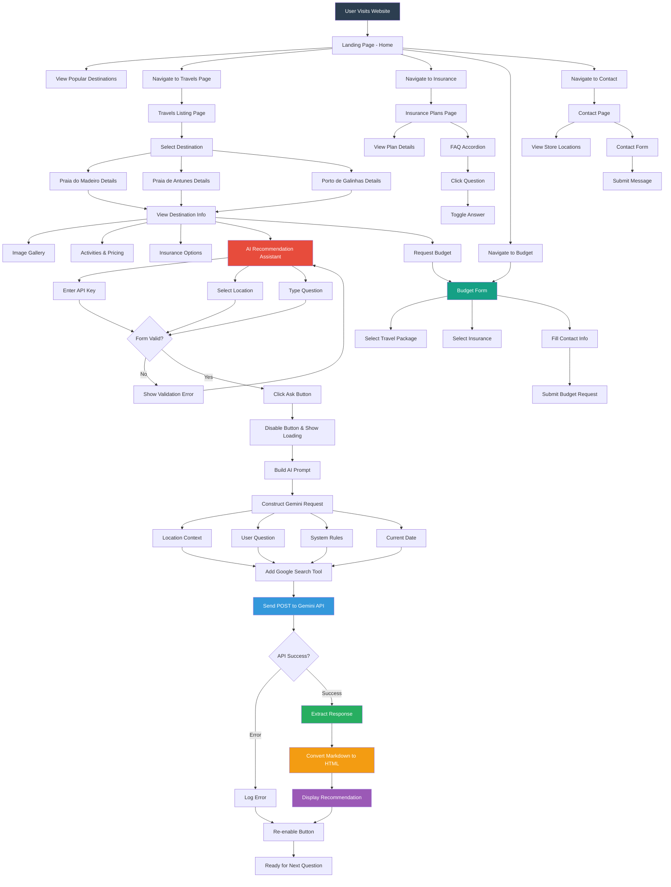

# Traveler - Your AI-Powered Travel Agency

A travel agency website featuring an intelligent AI recommendation assistant powered by Google's Gemini API. This project showcases a complete multi-page web application with interactive features, smooth animations, and real-time AI integration for personalized travel recommendations.

## Description

**Traveler** is a fictional travel agency web application designed to provide an intuitive and engaging user experience for travelers seeking beach destinations in Brazil. The platform combines traditional travel agency features with cutting-edge AI technology to offer personalized recommendations for tourists.

The application features a comprehensive multi-page structure including home, travel listings, insurance plans, budget calculator, contact information, and terms of service. The standout feature is the AI-powered Recommendation Assistant that leverages Google's Gemini API to provide intelligent, context-aware suggestions about tourist attractions, restaurants, and activities for three featured beach destinations: Praia do Madeiro, Praia de Antunes, and Porto de Galinhas.

## Main Application Flow



## Key Features

- **Home Page**: Introduction to agency services with featured popular destinations
- **Travel Listings**: Detailed information about tourist destinations including descriptions, prices, and activities
- **Insurance Plans**: Information about travel insurance plans offered
- **Budget Calculator**: Interactive form to request personalized travel and insurance quotes
- **Contact Section**: Contact information and form for inquiries and messages
- **Terms and Conditions**: Service usage policies and legal information
- **Responsive Design**: Layout adapts perfectly to different screen sizes (desktops, tablets, smartphones)
- **Smooth Animations**: Uses `simple-anime.js` to add elegant transitions and animations to page elements
- **AI Recommendation Assistant**: Allows users to ask questions about listed destinations (Praia do Madeiro, Praia de Antunes, Porto de Galinhas) and receive personalized recommendations for tourist attractions, restaurants, and activities using the Gemini API
- **Active Link Highlighting**: Automatic menu link activation based on current page
- **Interactive Gallery**: Click-to-swap image gallery on destination pages
- **FAQ Accordion**: Expandable questions and answers with accessibility features
- **URL Parameter Handling**: Pre-selects budget items based on URL parameters

## Technologies Used

- **HTML5**: Semantic and accessible structure
- **CSS3 (with BEM and CSS Variables)**: Modular, responsive, and maintainable styling
- **JavaScript (ES6+)**: Interactive logic, DOM manipulation, and API integration
- **Gemini API (Google AI Studio)**: Powers the intelligent recommendation assistant
- **Showdown.js**: Library to convert Markdown to HTML, used to format AI assistant responses
- **Simple Anime JS**: Lightweight library to manage animations based on data attributes

## How to Run the Project Locally

1. **Clone the repository**:
```bash
git clone https://github.com/luizaugustoliveira/traveler.git
cd traveler
```

2. **Open with a local server**:

3. **API Key Configuration (for Recommendation Assistant)**:
   To use the Recommendation Assistant, you'll need an API Key from Google AI Studio (Gemini API):
   - Create an account at [Google AI Studio](https://aistudio.google.com/)
   - Obtain an API Key
   - Enter it in the "Enter your Gemini API KEY" field in the "Recommendation Assistant" section on the "Travels" page

4. **Access in browser**: `http://localhost:8000`

## Project Structure

```
traveler/
├── css/
│   ├── chat/
│   │   └── style.css          # Recommendation assistant styles
│   ├── contato/
│   │   ├── contato.css        # Contact page styles
│   │   └── lojas.css          # Physical store styles
│   ├── global/
│   │   ├── footer.css         # Footer styles
│   │   ├── global.css         # Global styles (reset, base typography)
│   │   └── header.css         # Header styles
│   ├── home/
│   │   ├── depoimento.css     # Testimonial section styles
│   │   ├── expertise.css      # Expertise section styles
│   │   ├── introducao.css     # Introduction section styles
│   │   └── parceiros.css      # Partners section styles
│   ├── orcamento/
│   │   └── orcamento.css      # Budget page styles
│   ├── seguros/
│   │   ├── perguntas.css      # FAQ styles
│   │   ├── seguros.css        # Insurance page styles
│   │   └── vantagens.css      # Insurance benefits styles
│   ├── style.css              # Main CSS file (imports all others)
│   ├── termos/
│   │   └── termos.css         # Terms and conditions page styles
│   ├── utilidades/
│   │   ├── animacao.css       # Animation styles
│   │   ├── componentes.css    # Reusable component styles (buttons, etc.)
│   │   ├── cores.css          # Color variable definitions
│   │   └── tipografia.css     # Typography class definitions
│   ├── viagem/
│   │   ├── seguro.css         # Insurance section styles on travel page
│   │   └── viagem.css         # Individual travel detail page styles
│   └── viagens/
│       ├── viagens-lista.css  # Travel list styles on home page
│       └── viagens.css        # Main travels page styles
├── img/
│   ├── dec/                   # Decorative images (SVGs)
│   ├── fotos/                 # Destination photos
│   ├── icones/                # SVG icons
│   ├── parceiros/             # Partner logos (SVGs)
│   ├── redes/                 # Social media icons (SVGs)
│   ├── viagens/               # Travel listing images
│   └── traveler.svg           # Main logo
├── js/
│   ├── plugins/
│   │   └── simple-anime.js    # Animation plugin
│   └── script.js              # Main JavaScript logic
├── contato.html               # Contact page
├── index.html                 # Home page
├── orcamento.html             # Budget calculator page
├── seguros.html               # Insurance plans page
├── termos.html                # Terms and conditions page
├── viagens.html               # Travel listings page
└── viagens/                   # Individual destination pages
    ├── antunes.html           # Praia de Antunes details
    ├── madeiro.html           # Praia do Madeiro details
    └── porto.html             # Porto de Galinhas details
```

## Featured Destinations

The application showcases three beautiful beach destinations in Brazil:

1. **Praia do Madeiro** - A stunning beach in Rio Grande do Norte known for its natural beauty and dolphin sightings
2. **Praia de Antunes** - A paradise beach in Alagoas with crystal-clear waters and natural pools
3. **Porto de Galinhas** - One of Brazil's most famous beaches in Pernambuco, renowned for its natural pools and marine life

## JavaScript Features

The application includes several interactive JavaScript features:

- **Active Menu Links**: Automatically highlights the current page in the navigation menu
- **Budget Pre-selection**: Uses URL parameters to pre-select travel packages and insurance options
- **FAQ Accordion**: Expandable/collapsible questions with ARIA accessibility attributes
- **Image Gallery**: Interactive click-to-swap gallery on destination pages (desktop only)
- **Scroll Animations**: Smooth reveal animations using Simple Anime JS
- **AI Assistant Integration**: Real-time communication with Gemini API for personalized recommendations
- **Markdown Rendering**: Converts AI responses from Markdown to formatted HTML
- **Form Validation**: Client-side validation for all forms

## AI Recommendation System

The AI assistant is designed to:

- Provide location-specific recommendations for restaurants, attractions, and activities
- Use Google Search integration for up-to-date information
- Respond only to questions related to the selected destination
- Format responses in clear, concise Markdown
- Maintain context awareness with current date and location

## Responsive Breakpoints

- Mobile: < 600px
- Tablet: 600px - 1000px
- Desktop: > 1000px

## Security Considerations

- API keys are entered by users and not stored in the application
- All API communications use HTTPS
- No sensitive user data is stored client-side
- Form submissions can be configured with backend integration

## Author

**Luiz Augusto Oliveira de Farias**
